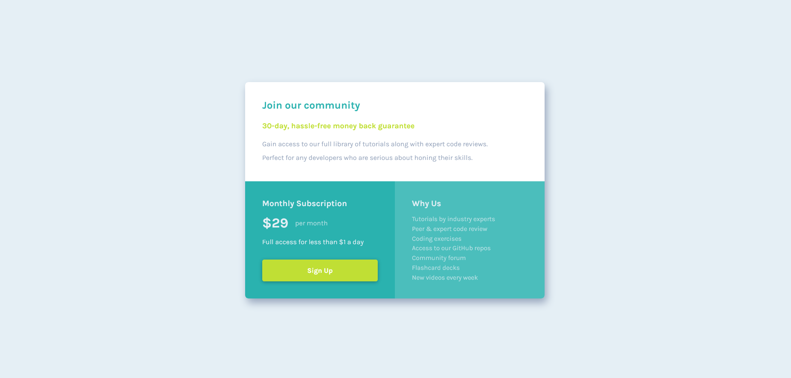

# Frontend Mentor - Single price grid component solution

This is a solution to the [Single price grid component challenge on Frontend Mentor](https://www.frontendmentor.io/challenges/single-price-grid-component-5ce41129d0ff452fec5abbbc). Frontend Mentor challenges help you improve your coding skills by building realistic projects!

## Table of contents

- [Overview](#overview)
  - [The challenge](#the-challenge)
  - [Screenshot](#screenshot)
  - [Links](#links)
- [My process](#my-process)
  - [Built with](#built-with)
  - [What I learned](#what-i-learned)
  - [Continued development](#continued-development)
  - [Useful resources](#useful-resources)
- [Author](#author)

## Overview

### The challenge

Users should be able to:

- View the optimal layout for the component depending on their device's screen size
- See a hover state on desktop for the Sign Up call-to-action

### Screenshot

Desktop view



### Links

- Solution URL: [Click here](https://www.frontendmentor.io/solutions/card-component-html5-scss-grid-flexbox-and-bem-OkgxH0YzG)
- Live Site URL: [See live site here](https://juanbonilla.me/FEM_single-price-grid-component/)

## My process

### Built with

- Semantic HTML5 markup
- CSS / SCSS custom properties
- Flexbox
- CSS Grid
- Mobile-first workflow
- BEM Methodology

### What I learned

In this project I save time modifying my layout with ```grid-template-areas```. In my opinion, it is easier to define names for each area in my layout instead of manually look and write from which row or column the section will occupy. For example:

```scss
.card {
    display: grid;
    grid-template-areas: "description"
                         "subscription"
                         "about";

    &__description {
      grid-area: description;
    }
}
```
When the device is a tablet, the layout could be changed:

```scss
@media only screen and (min-width: 768px) {
    .card {
      // Now description will have 2 columns, subscription and about will be in the same row   
      grid-template-areas: "description  description"
                            "subscription about";
    }
}
```

### Continued development

Use CSS Grid helps to facilitate the creation of a layout and changing it according to the screen size. So, I want to continue implementing this approach for my future projects.

### Useful resources

- [Grid Areas](https://www.w3schools.com/cssref/pr_grid-template-areas.asp) - This helped me to create a layout easily by just assigning areas for each section and modifying them according to the design provided.

## Author

- Website - [juanbonilla.me](https://juanbonilla.me)
- Frontend Mentor - [@juanpb96](https://www.frontendmentor.io/profile/juanpb96)
- LinkedIn - [Juan Bonilla](https://www.linkedin.com/in/juan-pablo-bonilla-6b8730115/)